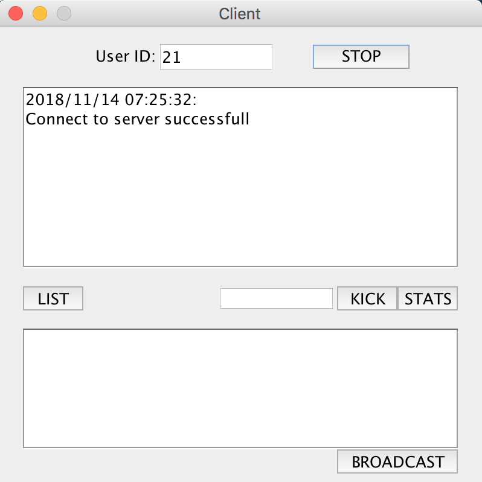

 <h2> User Manual</h2>

- Start
> The system will generate a random number as the user ID. Also you can change the user ID to what you want. Before it connects to the server, only the "Connect" button will be active, and the other four buttons will be inactive. So you can not execute any commands ("LIST","KICK","STATS","BROADCAST"). After you connect to the server, the "Connect" button will change to "Stop" button.

- Message Record
> Every time you execute a command, the system will return some messages as the result of your behavior. And the system will tell you the time and what the result is.If you fail to execute a command, the system will tell you why.

- Connected
> After you connected, you can click "Stop" button to disconnect to server or just close the window.
You can click "LIST" button to get the list of users who are online in the system.
After you enter the id of the user in the input field(on the left of "KICK" button), you can kick the user or get the stats of the user after you click "KICK" button or "STATS" button.
You can write some message in text input field which is on the bottom of the window, and click "BROADCAST" button to all users.